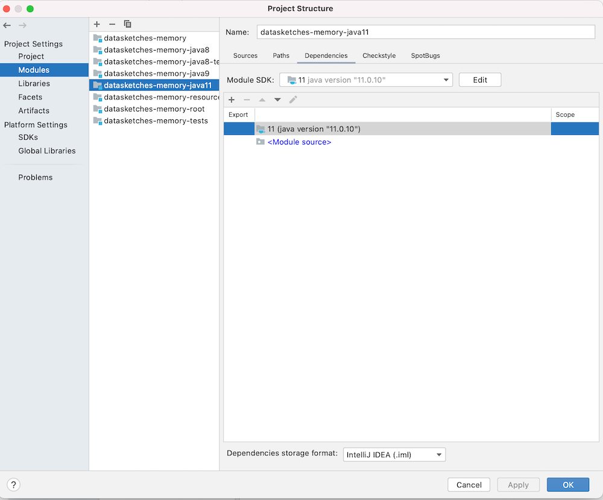
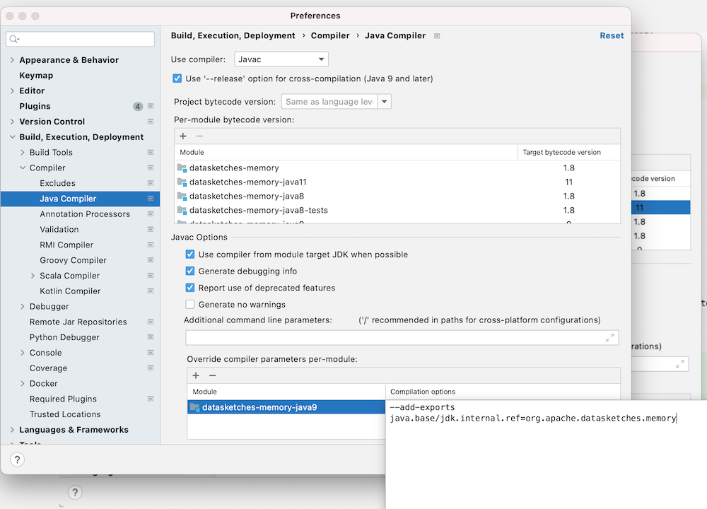

# IntelliJ IDE setup

The use of Maven submodules to build a Multi Release JAR was motivated by its compatibility with popular IDEs.

There are two configuration properties to be aware of when configuring your local development environment:

#### Java compiler versions

Settings are usually synchronised with maven toolchain configuration, otherwise the Java version for a maven module
should be set as follows:

| Maven submodule                   | JDK |
| --------------------------------- | --- |
| datasketches-memory-root			|  8  |
| datasketches-memory			    |  8  |
| datasketches-memory-java8			|  8  |
| datasketches-memory-java8-tests	|  8  |
| datasketches-memory-java9		    |  9  |
| datasketches-memory-java11		|  11 |
| datasketches-memory-resources     |  8  |

#### Compiler arguments for JPMS

In order to compile Maven modules in Java versions 9 and above, it is necessary to provide the following arguments to the
compiler.  These are usually synchronised with the `pom.xml` configuration:

```xml
    <compilerArgs>
        <arg>--add-exports</arg>
        <arg>java.base/jdk.internal.ref=org.apache.datasketches.memory</arg>
    </compilerArgs>
```

---

Note that the following configuration was verified using IntelliJ IDEA 2021.1.2 (Community Edition).

#### Java compiler versions

Ensure that the correct SDK is used for each module using the IntelliJ project structure dialog:



---

#### Compiler arguments for JPMS

Ensure that the required JPMS arguments are set for the compiler (Java 9 only).  These should be detected and set automatically based on the `pom.xml` configuration.


