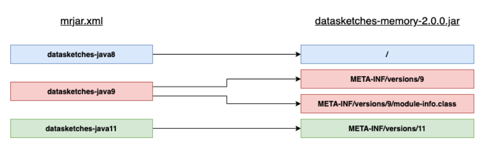
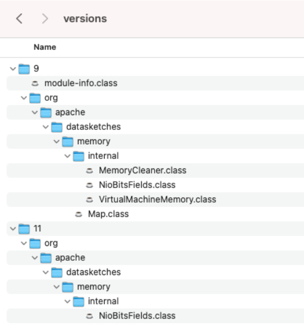

# Multi-Release JAR

The `datasketches-memory` module assembles a JAR for release that consists of multiple Java-release-specific versions
of class files to coexist in a single archive (the MR-JAR).

From [JEP-238](https://openjdk.java.net/jeps/238):

> Third party libraries and frameworks typically support a range of Java platform versions, generally going several 
  versions back. As a consequence they often do not take advantage of language or API features available in newer 
  releases since it is difficult to express conditional platform dependencies, which generally involves reflection, or
  to distribute different library artifacts for different platform versions.

and, specifically for libraries like `datasketches-memory`:

> Some libraries and frameworks, furthermore, use internal APIs of the JDK that will be made inaccessible in Java 9
  when module boundaries are strictly enforced. This also creates a disincentive to support new platform versions when
  there are public, supported API replacements for such internal APIs.

### Assembly

The Maven assembly plugin uses the Maven submodules during the `package` phase.  The following maven submodules to
source the compiled class files for the MR-JAR:

### Manifest

The Maven assembly plugin copies version specific class files into JAR manifest META-INF directory, as
shown in the diagram below:

